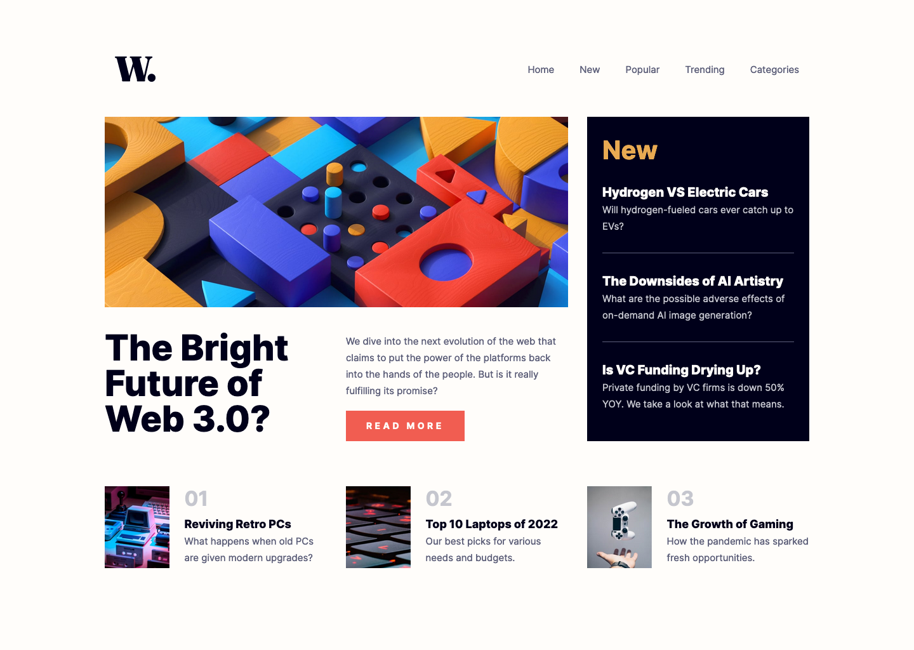

# News homepage solution

This is a solution to the [News homepage challenge on Frontend Mentor](https://www.frontendmentor.io/challenges/news-homepage-H6SWTa1MFl). Frontend Mentor challenges help you improve your coding skills by building realistic projects.

| [Live Demo Link](https://ionstici.github.io/news-homepage) | [Frontend Mentor Link](https://www.frontendmentor.io/solutions/news-homepage-8IABqH64cx) |
| ---------------------------------------------------------- | ---------------------------------------------------------------------------------------- |

## About the project

"News homepage" is a nice coding challenge, perfect for honing your CSS layout skills and for implementing an interactive mobile navigation while keeping desktop nav formatted properly without any dependencies (except Scss obviously).

## Built with

-   Semantic HTML5 markup
-   CSS / Scss & Flexbox and CSS Grid
-   Mobile-first workflow
-   Interactive mobile-nar using JavaScript

## Getting Started

```bash
git clone https://github.com/ionStici/news-homepage.git
cd news-homepage
npm install
npm start
# Open on localhost the preview in your browser
```

## Preview


